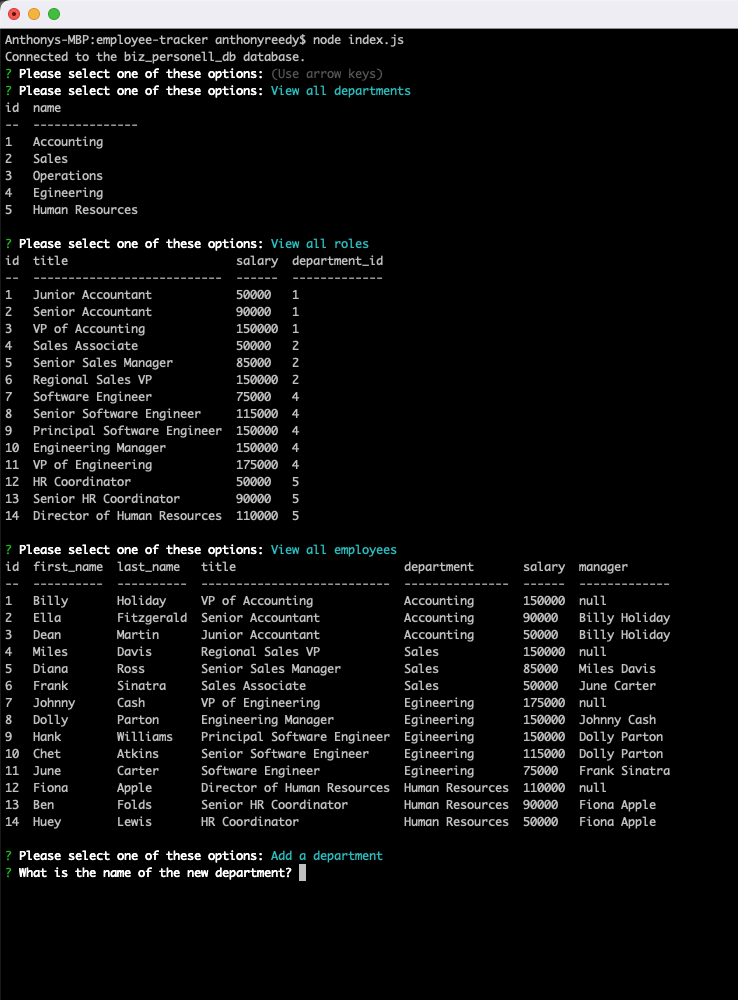

# Employee Tracker

## Description

This application is a tool for a business owner to quickly look at important information about their personell, including departments, various roles at the company, and important information on all employees. It also provides some functionality to change the personell. Working on this project helped me develop my MySQL query writing skills, as well as further develop my knowledge with node.js and Inquirer. 

[Link To Repo](https://github.com/asreedy82/employee-tracker)

## Installation

In order to use this application, node.js, Inquirer, and MySQL2 need to be installed in the Terminal at the root of the project folder. A MySQL tool such as MySQL Workbench is also necessary to be able to interact with the database. To install Inquirer, first run `npm init -y` then run `npm i inquirer@8.2.4`. To install MySQL, run `npm i mysql2`. After that, it is a good idea (and often necessary) to run `npm install` from terminal before beginning any future sessions. You will also need to create the database schema and tables and insert seed data into those tables. Run the SQL statements from `schema.sql` to create the database and tables. Then run the SQL statements in `seeds.sql` to seed some starter data. To initiate the app, run `node index.js` then follow the prompts.

  - Link to video demo of app [Screencast Link](https://watch.screencastify.com/v/X9sIrTGN0LVc5CfeHVv1)

## Usage

The application is a tool for a business owner to let them manage their departments, roles, and employees. It will help the owner keep track of the work force and help them keep track of roles, salaries, managers, new employees, etc. 

## Credits

N/A

## License

N/A

### Author: Anthony Reedy